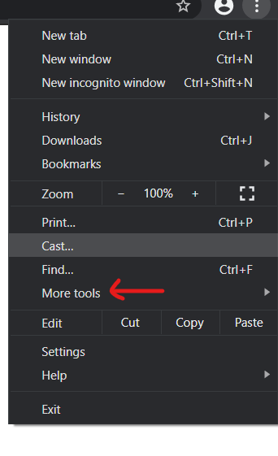
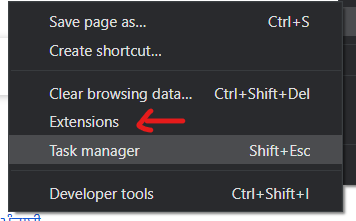
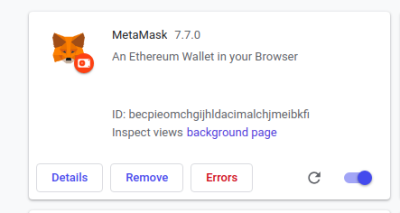
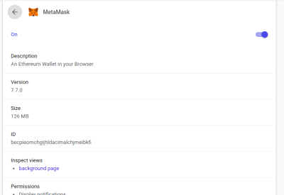
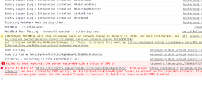

# How to create a Metamask Plugin

## What is It?

A Metamask plugin is a script which allows developers to customize the browser extension and introduce extra features with the help of powerful APIsk. By default, the plugin system has zero privilege though, there are several methods in the snaps which enables a permission system a developer can offer to users according to the needs of a dapp.

## Why Snaps?

Everyday new protocols are introduced in the ecosystem, and their associated dapp may require interacting with user accounts, or running a persistent script on the user’s behalf, either to monitor state, pre-process transactions, or to serve up a new peer to peer file transport to different sites with a shared cache.

Dapp to dapp, these requirements vary but with the current implementation of the Metamask, users are asked to install the extension and accept security-sensitive permissions. Also, if a dapp uses Metamask as their web3 provider it cannot introduce any additional features to the wallet.

After realizing that adding functionality is a powerful pattern, arguably the hallmark of open computing, Metamask introduced Snaps: The Metamask Plugin System.

## How it works

A plugin script is able to add different functionalities by making API calls. Metamask introduced the [`wallet` API](https://github.com/MetaMask/metamask-snaps-beta/wiki/Snaps-API#the-snaps-wallet-api), which is an extension of [`web3.currentProvider` API](https://web3js.readthedocs.io/en/v1.2.1/web3.html#currentprovider) and allows developers to build better permission systems. 

For example, a file-sharing plugin doesn’t need to know what page you’re on, just what hash you want to load or set. 

## Different Plugin Ideas

Every plugin has the ability to provide its own API to the sites that a user visits, as well as to other plugins, allowing plugins to build upon each other, in a sort of decentralized dependency graph. For example, a state channel plugin might rely on a whisper plugin. 

### Smart Contract Security

Smart Contract Security is a huge issue, both because you can never be secure enough, and no matter how many layers of checks you add, you always have to ask who watches the watchmen? Plugins could add warnings or endorsements of accounts wherever MetaMask displays them.

[More information](https://github.com/MetaMask/metamask-snaps-beta/wiki/Snaps-API#recipient-address-auditing)

### ENS to resolve names

Decentralized name systems are an exciting opportunity for loading content outside of the traditional certificate authority system, and we don’t want to dictate what name systems a user can subscribe to!

[More information](https://docs.ens.domains/dapp-developer-guide/resolving-names)

### Privacy protocols

Privacy-centric protocols require unique forms of cryptography, so rather than try to implement every kind of signing algorithm in existence and audit and merge them. 

Developers can use the [wallet.getAppKey() API](https://github.com/MetaMask/metamask-snaps-beta/wiki/Snaps-API#app-keys) to get a unique private key for their domain, generated from the user’s own seed phrase uniquely for the plugin’s origin, which is now treated as the authority for that key type. Developers can then use a JavaScript confirmation to get user consent for that type of signature.

### Layer 2 Scaling

Metamask introduced a suite of plugins APIs that open dapp development to decentralized agreements off the main Ethereum chain. For instance, switching from main chain to side chain requires user to perform manual switching. Snap's permission with the [wallet.getAppKey() API](https://github.com/MetaMask/metamask-snaps-beta/wiki/Snaps-API#app-keys) or the [wallet_manageAssets](https://github.com/MetaMask/metamask-snaps-beta/wiki/Snaps-API#custom-asset-management) can help to automate this process.  

### APIs currently provided

-   `.registerRpcMessageHandler(rpcMessageHandler)` - Used to extend the MetaMask API exposed to dapps. Developers can create their own APIs making this extendible and powerful.

-   `.registerApiRequestHandler(handler)` - Used to create responsive, event driven APIs, that can be provided to the dapp.

-   `.onMetaMaskEvent(eventName, callback)` - Just for beta purposes, exposes every event internal to the MetaMask controllers for Transactions, Networks, and Block tracking. Some are :-

    -   `tx:status-update`: Be notified when the status of your transactions changes
    -   `latest`: Be notified when new blocks are added to the blockchain
    -   `networkDidChange`: Be notified when your selected network changes
    -   `newUnapprovedTx`: Be notified with details of your new transactions

    Developers can ask for permissions for the above in the following format:

    ```json
    "initialPermissions": {
      "metamask_newUnapprovedTx": {}
    }
    ```

-   `.getAppKey()` - Every Snap can request a unique secret seed based on `hash(script_origin + user_private_key)`. It is available in the Snap globally as `wallet.getAppKey()`. This method returns a promise, which resolves to a 32 byte (64 character) hex-encoded string which is re-generated if the user were to have their computer wiped, but restored MetaMask from the same seed phrase.

-   `.updatePluginState(yourStateToPersist)` - Used to persist state to our data store in the browser.

-   `.getPluginState()` - Returns whatever the most recent value you passed to `.updatePluginState()`. Useful when first starting up your Snap to restore its state.

_A list of all the methods is available in the [documentation](https://github.com/MetaMask/metamask-snaps-beta/blob/develop/app/scripts/controllers/permissions/restrictedMethods.js)._

## Installing Metamask Snaps Beta

In this tutorial, we install Metamask Snaps Beta and do a basic setup.

### Prerequisites

A Chromium-based, and preferably a Linux or macOS operating system. Disable any existing metamask extension. 

## Installing the MetaMask Snaps Beta

Follow the below commands to clone and build special fork of Metamask:

```shell
git clone git@github.com:MetaMask/metamask-snaps-beta.git
cd metamask-snaps-beta
yarn install
yarn start
```

1.  Click on the menu option in top right corner.


2.  Click on more tools. 



3.  Click on Extensions 



4.  Make sure that Developer Mode is on


5.  Click on Load Unpacked option and choose the Metamask-snaps-beta/dist/chrome folder to load you metamask.


`yarn start` automatically rebuilds MetaMask on any file change. You can then [add your custom build to your browser](https://metamask.zendesk.com/hc/en-us/articles/360016336611-Revert-Back-to-Earlier-Version-or-Add-Custom-Build-to-Chrome).

You now have the forked the Metamask running on your machine.

### Running Snap Dapps

For building and running Snaps. Metamask provides the utility [snaps-cli](https://github.com/MetaMask/snaps-cli). 

Install snaps-cli:

```shell
git clone https://github.com/MetaMask/snaps-cli
cd snaps-cli
npm i -g snaps-cli
```

To check the tools provided by snap-cli, run `mm-snap --help`.

## Initializing

Metamask provided some examples in this [folder](https://github.com/MetaMask/snaps-cli/tree/master/examples).

Let's start with the simplest one, `hello-snaps`

```shell
cd examples/hello-snaps
mm-snap build
mm-snap serve
```

-   `mm-snap build`: Build snap from sources into _bundle.js_
-   `mm-snap serve`: Locally serve Snap file(s) for testing  

This should give you a message `Server listening on: http://localhost:8081`. You can configure the port, and the build target are configured in `snap.config.json`, or with command line arguments. You can now open that address in your browser, and if you have installed your Snap branch of MetaMask correctly, you should be able to:

-   Click the "Connect" button on the site.
-   Approve the site's permissions request (which includes the Snap installation!)
-   Approve the Snap's permissions request (which in this case is permission to show alerts to you, to send its message)
-   Click the "Send Hello" button to receive a greeting from the Snap.

### Project structure

-   `dist` folder - minified/concatenated version of code used on production sites
-   `bundle.js` - bundled js file of snap
-   `index.js` - unminified snap code
-   `package.json` - Add permissions your plugin needs under the `web3Wallet` key
-   `snap.config.json` - Snap configuration 
-   `index.html` - Interacts with the Snap using two basic API calls. 
-   `index.js` - Add API methods to connect to websites from within a Snap. Also contains the Snap Code.

#### Snap Code `index.js`

```javascript
wallet.registerRpcMessageHandler(async (originString, requestObject) => {
  switch (requestObject.method) {
    case 'hello':
      return wallet.send({
        method: 'alert',
        params: [`Hello, ${originString}!`]
      })
    default:
      throw new Error('Method not found.')
  }
})
```

The code registers an RPC Handler i.e., creates a developer defined API by the name of `hello` which the frontend can call. 

`requestObject` contains the method for the plugin to execute.

`alert` is an inbuilt method which allows us to create an alert on the webpage. An alert is created when the hello method is called using the metamask API.

#### Dapp Code `index.html`

```javascript
async function connect () {
      await ethereum.send({
        method: 'wallet_enable',
        params: [{
          wallet_plugin: { [snapId]: {} },
        }]
      })
    }

// here we call the plugin's "hello" method
async function send () {
    try {
      const response = await ethereum.send({
        method: 'wallet_invokePlugin',
        params: [snapId, {
          method: 'hello'
        }]
      })
    } catch (err) {
      console.error(err)
      alert('Problem happened: ' + err.message || err)
    }
  }
```

The `connect` function is called to connect metamask with the plugin and download it if does not exist. 

When the `wallet_enable` method is sent, Metamask asks the user for the permissions set by the plugin.

`wallet_invokePlugin` is another method used to call an RPC method declared above, `hello` in our example. The `hello` case in our switch statement is called leading to an alert.

## Debugging Your Snap :

1.  Right-click the MetaMask flogoox in the top right of your browser.


2.  Select Manage Extensions.
3.  Ensure "Developer Mode" is selected in the top right.
4.  Click on details button on metamask extension. 



5.  Scroll down to MetaMask, and click the "Inspect views: background page" link.



6.  Wait for the new Inspector window to open. 
7.  Click Console at the top of the Inspector window.
8.  Look for any strange logs, especially red errors!


