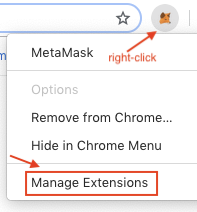

# How to create a Metamask Plugin

## What is It?

Metamask plugin is a script which allows developers to customize the extension and introduce extra features with the help of powerful APIs provided by metamask. By default, the plugin system has zero privilege. Though, there are several methods in the snaps which enables a permission system that can be offered to the users according to the requirement of DApps. 


## Why Snaps?

Everyday new protocols are being introduced in the ecosystem, and their DApp requires interacting with User accounts, and running a persistent script on the user’s behalf, either to monitor state, pre-process transactions, or even just to serve up a new peer to peer file transport to different sites with a shared cache.
DApp to DApp, these requirements vary but the current implementation of the Metamask, users are asked to install the extension and say yes to security-sensitive permissions. Also, if DApp uses Metamask as their web3 provider. They can not introduce any additional features to the wallet. 

After realizing that adding functionality is an incredibly powerful pattern, arguably the `hallmark of open computing`. To serve different use cases where innovation can be made possible with development, Metamask introduced Snaps: The Metamask Plugin System.


## How it works ?

The plugin script will be able to add different functionalities by making API calls. Metamask has introduced `wallet` API, which is an extension of `web3.currentProvider` API. This will allow developers to build better permission system, and user experience. For example, a file-sharing plugin doesn’t need to know what page you’re on, just what hash you want to load or set. This plugin can operate with little knowledge of what is going on. 

## Different Plugin Ideas

Every plugin has the ability to provide its own API to the sites that a user visits, as well as to other plugins, allowing plugins to build on each other, in a sort of decentralized dependency graph. For example, a state channel plugin might rely on a whisper plugin. 

### Smart Contract Security || auditAddress plugin API
Smart Contract Security is a huge issue, both because you can’t be secure enough, and no matter how many layers of checks you add, you always have to ask who watches the watchmen?
- plugins could add warnings or endorsements of accounts wherever MetaMask displays them.

### ENS || resolveName plugin API
Decentralized name systems are an exciting opportunity for loading content outside of the traditional certificate authority system, and we don’t want to dictate what name systems a user can subscribe to!
- This API can allow the addition of new name resolving strategies.

### Privacy protocols || getAppKey() | confirm plugin API

Privacy-centric protocols require unique forms of cryptography, so rather than try to implement every kind of signing algorithm in existence and audit and merge them. 

- The first team that requires a new curve can use our wallet.getAppKey() API to get a unique private key for their domain, generated from the user’s own seed phrase uniquely for the plugin’s origin, which is now treated as the authority for that key type, which can also use our confirm API to get user consent for that type of signature.

### Layer 2 Scaling || getAppKey() | wallet_manageAssets()

This is a WIP. Metamask has introduced a suite of plugins APIs will unlock dapp development to innovate decentralized agreements far off the main chain. For instance, switching from main chain to side chain requires user to perform manual switching. Snap's permission system can help to automate this process.  

# Installation

In this tutorial, we install Metamask Snaps Beta and do a basic setup.

## Prerequisites

Google Chrome, and preferably *nix(Ubuntu/Mint etc) environment. Also, disable any existing metamask extension. 

## Getting Started

### Installing the MetaMask Snaps Beta

* Follow the below commands to clone and build special fork of Metamask:

```shell
git clone git@github.com:MetaMask/metamask-snaps-beta.git
cd metamask-snaps-beta
yarn install
yarn start
```

1. Click on the menu option in top right corner.


2. Click on more tools. 


3. Click on Extensions 


4. Make sure that Developer Mode is on


5. Click on Load Unpacked option and choose the Metamask-snaps-beta/dist/chrome folder to load you metamask.


`yarn start` will auto rebuild MetaMask on any file change. You can then [add your custom build to Chrome](https://metamask.zendesk.com/hc/en-us/articles/360016336611-Revert-Back-to-Earlier-Version-or-Add-Custom-Build-to-Chrome).

You now have the forked the metamask on your machine.

### Running Snap Dapps

For building and running the snaps. Metamask provides us with the utility [snaps-cli](https://github.com/MetaMask/snaps-cli). 

Install snaps-cli:

```shell
git clone https://github.com/MetaMask/snaps-cli
cd snaps-cli
npm i -g snaps-cli
```
To check the tools provided by snap-cli, run `mm-snap --help`.

## Initializing

Metamask has provided with the some examples in this [folder](https://github.com/MetaMask/snaps-cli/tree/master/examples).

Let's start with the simplest one, `hello-snaps`

```shell
cd examples/hello-snaps
mm-snap build
mm-snap serve
```

`mm-snap build`: , build snap from sources into bundle.js
`mm-snap serve`: Locally serve Snap file(s) for testing  


This should give you a message `Server listening on: http://localhost:8081`. That port, and the build target are configured in the `snap.config.json` file, or command line arguments. You can now visit that address in your browser, and if you have installed your Snap branch of MetaMask correctly, you should be able to:

* Click the "Connect" button on the site.
* Approve the site's permissions request (which includes the Snap installation!)
* Approve the Snap's permissions request (which in this case is permission to show alerts to you,   to send its message)
* Click the "Send Hello" button to receive a greeting from the Snap.


### Abstract level code description.

File Structure :- 
Dist
Bundle.js - bundled js file of snap
Index.js - snap code
Package.json - Permissions are put here
Package.-lock.json
Snap.config.json - Snap configuration 
 
The permissions the Snap initially requests are configured in its `package.json`, under the `web3Wallet key`.

`index.html` file, interacts with the Snap using two basic API calls. It contains the DApp code. 
In the `index.js` file, you can add API methods to connected websites from within a Snap. It contains the Snap Code.

#### Snap Code `index.js`
```
wallet.registerRpcMessageHandler(async (originString, requestObject) => {
  switch (requestObject.method) {
    case 'hello':
      return wallet.send({
        method: 'alert',
        params: [`Hello, ${originString}!`]
      })
    default:
      throw new Error('Method not found.')
  }
})
```

The code registers a RPC Handler i.e., creates a developer defined API by the name of `hello` which can be called via the frontend given below. 

- `requestObject` contains the method to be executed
- `Alert` is an inbuilt method which allows us to create an alert on the webpage. 
- An alert is created when the hello method is called using the metamask api.

#### Dapp Code :- `index.html`
```
async function connect () {
      await ethereum.send({
        method: 'wallet_enable',
        params: [{
          wallet_plugin: { [snapId]: {} },
        }]
      })
    }

    // here we call the plugin's "hello" method
 async function send () {
      try {
        const response = await ethereum.send({
          method: 'wallet_invokePlugin',
          params: [snapId, {
            method: 'hello'
          }]
        })
      } catch (err) {
        console.error(err)
        alert('Problem happened: ' + err.message || err)
      }
    }
```
- `Connect` function is called to connect metamask with the plugin and download it if does not exist. 
- `wallet_enable` - when this method is sent, the metamask asks user for the permissions of the plugin.
- `wallet_invokePlugin` is another method used to call an RPC method we declared above `hello` in our case. The hello case in our switch statement is called leading to an alert.

**Note**: For starting your own Snap, you might want to just copy one of the examples to get started! Then you can follow up by using plugin APIs explained below and make edits in `index.html` and `index.js`.


### Plugin APIs

APIs Currently Provided -
-   `.registerRpcMessageHandler(rpcMessageHandler)` - Used to extend the MetaMask API exposed to dapps. Developers can create their own APIs making this very extendible and powerful.
-   `.registerApiRequestHandler(handler)` - Used to create Responsive, Event Driven APIs, that can be provided to the dapp.
- `.onMetaMaskEvent(eventName, callback)` - Just for beta purposes, exposes every event internal to the MetaMask controllers for Transactions, Networks, and Block tracking. Some are :-
	- `tx:status-update`: 'Be notified when the status of your transactions changes',
	- `latest`: 'Be notified when the new blocks are added to the blockchain',
	- `networkDidChange`: 'Be notified when your selected network changes',
	- `newUnapprovedTx`: 'Be notified with details of your new transactions',


Permission for above can be asked in the following format:-
```
"initialPermissions": {
    "metamask_newUnapprovedTx": {}
}
```
-   `.getAppKey()` - Every Snap can request a unique secret seed based on `hash(script_origin + user_private_key)`. It is available on the Snap global as `wallet.getAppKey()`. This method returns a promise, which resolves to a 32 byte (64 character) hex-encoded string which will be re-generated if the user were to have their computer wiped but restored MetaMask from the same seed phrase.
-   `.updatePluginState(yourStateToPersist)` - Used to persist state to our store.
-   `.getPluginState()` - Returns whatever the most recent value you passed to `.updatePluginState()`. Useful when first starting up your Snap to restore its state.

Above APIs can be changed or removed in the future.
A list of all the methods are given here. These can be asked for in permissions and then called :- [Link](https://github.com/MetaMask/metamask-snaps-beta/blob/develop/app/scripts/controllers/permissions/restrictedMethods.js)

### Debugging Your Snap :- 

1. Right-click the MetaMask fox in the top right of your browser.



2. Select Manage Extensions.
3. Ensure "Developer Mode" is selected in the top right.
4. Click on details button on metamask extension. 


5. Scroll down to MetaMask, and click the "Inspect views: background page" link.


6. Wait for the new Inspector window to open. 
7. Click Console at the top of the Inspector window.
8. Look for any strange logs, especially red errors!


